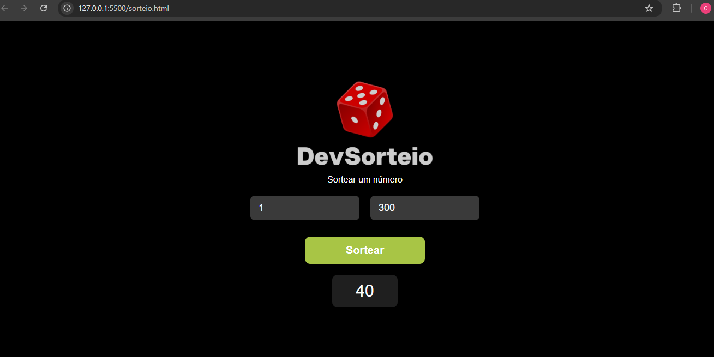

# 🎲 DevSorteio

Projeto simples de **sorteador de números** desenvolvido com **HTML, CSS e JavaScript**.

Este projeto foi criado como parte dos meus **estudos em desenvolvimento web**, com o objetivo de praticar a criação de interfaces e manipulação do DOM utilizando JavaScript.

---

## 📸 Preview do projeto



---

## 🚀 Funcionalidades

* Inserir um número **mínimo**
* Inserir um número **máximo**
* Sortear um número **aleatório dentro do intervalo informado**
* Exibir o resultado na tela

---

## 🛠️ Tecnologias utilizadas

* HTML5
* CSS3
* JavaScript

---

## 📂 Estrutura do projeto

```
dev-sorteio
│
├── sorteio.html
├── style.css
├── script.js
├── README.md
│
└── images
      dice.png
      screenshot.png
```

---

## 🎯 Objetivo do projeto

Este projeto foi desenvolvido para praticar conceitos importantes de programação front-end, como:

* Estruturação de páginas com **HTML**
* Estilização com **CSS**
* Manipulação de elementos com **JavaScript**
* Uso de **eventos e funções**
* Geração de **números aleatórios**

---

## 👩‍💻 Autora

Desenvolvido por **Carolina Graziani**

🔗 GitHub:
https://github.com/carolinagraziani33

---

## 📚 Projeto de estudo

Este projeto faz parte do meu processo de aprendizado em **desenvolvimento web** e será atualizado conforme avanço nos estudos.
